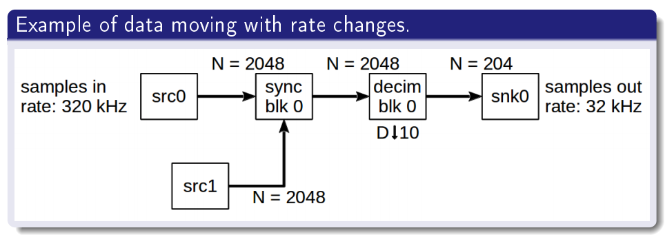
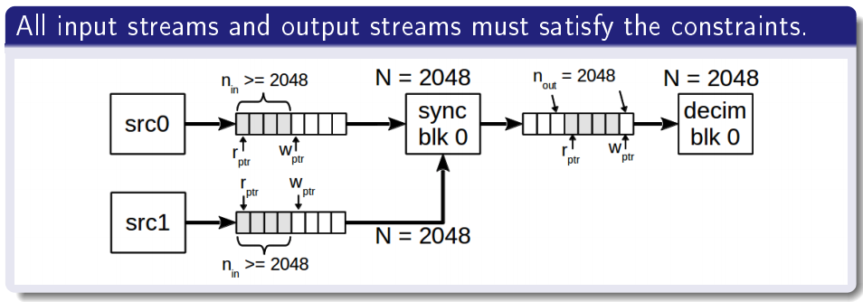
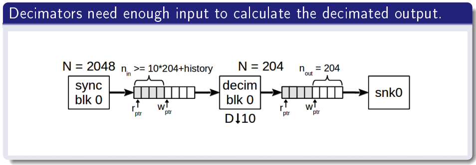
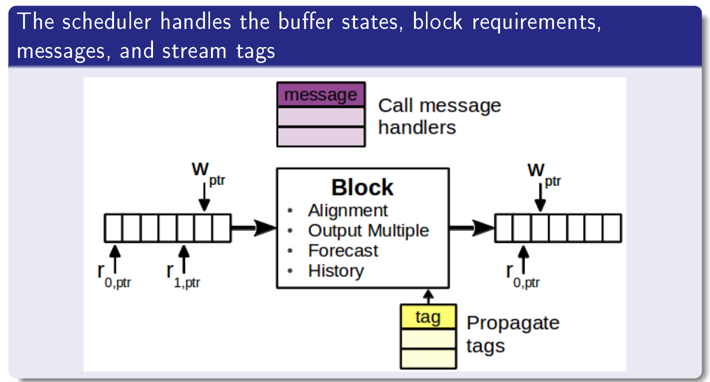
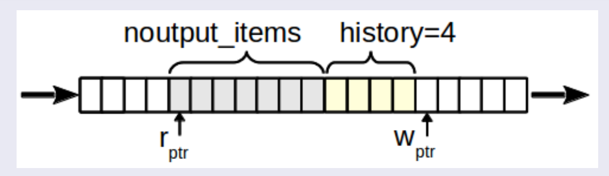
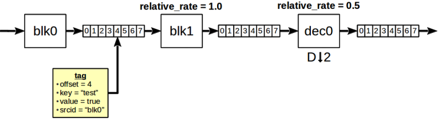
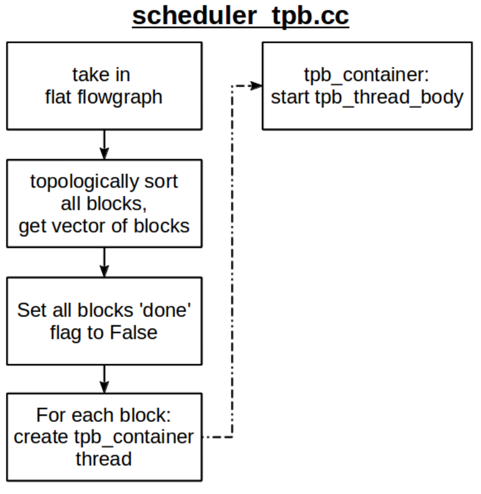

GNURadio scheduler
======================

GNURadio的scheduler是数据流调度的核心。这个部分的文档很少，本文主要参考 gnuradio-note_ 的slides，以及笔者的一些源码阅读。

.. _gnuradio-note: http://www.trondeau.com/blog/2013/9/15/explaining-the-gnu-radio-scheduler.html

首先看一个例子。两个数据流经过同步模块，再经过十倍欠采样模块，最后输出。

对于每个模块之间，调度器都会维护一个buffer。对于一个block输入是input buffer，输出是output buffer。在output区，block利用Wptr指针写数据；在input区，block利用Rptr指针读取数据。

对于模块Decimator，我们需要足够的输入来计算输出。

接着我们复习一下block的工作函数。

general_work()和work()
---------------------------

general_work()和work()是block工作的核心函数，数据流的操作都在这里完成。

.. code-block:: cpp

    int block::general_work(int noutput_items,
        gr_vector_int &ninput_items,
        gr_vector_const_void_star &input_items,
        gr_vector_void_star &output_items)

input_items 是一个vector包含一组指针指向input buffer。output_items 是一个vector包含一组指针指向output buffer。general_work()方法不指定输入输出的关系，只是指定输入和输出的数量。noutput_items是最小的output数量。ninput_items是input buffer。

.. code-block:: cpp

    int block::work(int noutput_items, 
        gr_vector_const_void_star &input_items,
        gr_vector_void_star &output_items)

work函数指定了input和output的关系。通过noutput_items确定ninput_items。有了这些知识，我们开始看scheduler的工作方式。

Scheduler block
---------------------

Block之间会传递data，messages，tags。对于Data，blocks有几个需求：alignment，output multiple，forecast，history。alignment和output multiple都是为了控制输出的数据量要满足一定的倍数。forecase和history都是控制buffer的数据满足读取的需求。GNURadio的调度器会处理block的需求，以及控制buffer缓冲区。除此之外，buffer，messages流和stream tags也会由调度器控制。调度器主要控制缓冲区大小和延迟。

 ** Data调度**

调度器调度数据主要就是满足alignment，output multiple，forecast，history的需求。

* alignment: 将输出对齐到一定倍数，不一定保证。
* output multiple：将输出对齐到一定倍数，保证实现。如不满足会等待。
* forecast：利用ninput_items_required[i]告诉调度器，对于每个输出需要多少输入。
* history：利用set_history()方法，高速scheduler进一步调整buffer的长度。如果我们将history设置为N，那么buffer里的前N个数据中的N-1个数据为历史数据（即使你已经用过了）。history保证了buffer里至少有N-1个数据。

当我们给定输出的数据数量noutput_items，那么我们可以计算输入数据量ninput_items_required[i]：

.. code-block:: cpp

    //forecast()
    ninput_items_required[i]=noutput_items+history()-1; // default
    ninput_items_required[i]=noutput_items*decimation()+history()-1; // Decim
    ninput_items_required[i]=noutput_items/interpolation()+history()-1; // Interp

经过这样的forecast设置，可以保证输入满足输出的需求。

**Buffer and Controlling flow and latency**

.. code-block:: cpp

    // Caps the maximum noutput_items.
    // Will round down to nearest output multiple, if set.
    // Does not change the size of any buffers.
    set_max_noutput_items(int)
    // Sets the maximum buer size for all output buers.
    // Buffer calculations are based on a number of factors, this limits overall size.
    // On most systems, will round to nearest page size.
    set_max_output_buffer(long)
    // Sets the minimum buer size for all output buers.
    // On most systems, will round to nearest page size.
    set_min_output_buffer(long)

 **Scheduler manages the Data stream Condition**

 * 计算input有多少可用的点
 * 计算output有多空间
 * 确定限制条件: history, alignment, forecast
 * call general_work，给block恰当的指针和数据
 * 从general_work的返回值更新指针

 ** Messages调度**

每个block可以创建自己的Messages queue。当messages传递的时候，messages会放到subscriber的queue里。Messags的优先级是高于data的，在后面的整体操作流程中，优先处理messages。调度器dispatch处理messags是通过调用block的handler实现的。Messags的queue大小是由max_nmsgs控制的。

 ** Stream Tags 调度**

Steam tags是帮助block标记和识别处理过的数据。对于一个指定的samples，我们打上一些tag。tag会逐级传递。随着data rate的变化，tag的位置会更新。tag_propagation_policy标签的传递规则是有block的构造器控制的。tag的处理是在general_work后面。tag_propagation_policy有两种TPP_ALL_TO_ALL和TPP_ONE_TO_ONE。第一种会把所有Tag都标上每一个samples，后一种是一对一的。

Scheduler Flow Chart
---------------------------

有了上面的基础，我们就做好了了解scheduler如何调度一个完整的gnuradio flow chart的准备。起初，调度器会为每个模块初始化创建一个线程。tpb_container为block的线程池。

tpb_thread_body会控制所有线程。首先设置线程优先级。如果block就绪了，就可以处理传递的messages。如果input的数据量不够，会将block设置为BLKD_IN。直到数据流满足了需求，进入核心函数run_one_iteration()。这个函数在block_executor.cc文件中实现。如果函数结束，ready状态的时候，会通知与这个block相邻的其他block。告诉他们，input和output缓冲区的状态。如果是READY_NO_OUTPUT，则说明没有数据输出，通知上一block。如果DONE，传递DONE的消息到其他所有block。

.. image:: ../fig/scheduler-thread.png

